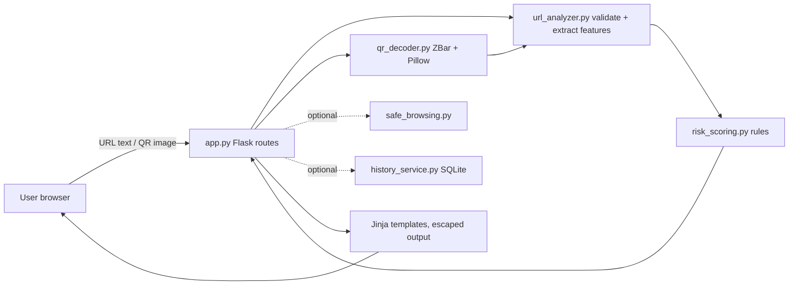

# PhishGuard
**Think Before You Click.**

## Overview
PhishGuard is a beginner-friendly, defensive cybersecurity web app built with Flask. You can paste a URL or upload a QR-code image, and it produces an explainable, rule-based phishing-risk report by analyzing the **text** of the link only. It never opens, fetches or previews submitted URLs. It also includes an awareness guide and a quiz.

## Problem statement
Phishing links arrive through WhatsApp, email, SMS, Instagram and QR codes. QR codes hide the link from the human eye, and many people cannot tell a suspicious link from a normal one. PhishGuard teaches the warning signs by showing exactly why a link looks risky.

## Main features
- URL scanner with strict http/https validation
- Transparent scoring engine (0-100) with a reason for every point
- QR image scanner (decoded in memory, never stored)
- Optional Google Safe Browsing check (off by default)
- Awareness page and 10-question quiz
- Optional anonymous history (off by default, hashed domains only)
- `/health` endpoint, custom error pages, Render deployment files

## Tech stack
Python 3.11+, Flask, Bootstrap 5 and Bootstrap Icons (CDN), tldextract, validators, Pillow, pyzbar, requests, python-dotenv, SQLite (`sqlite3`), pytest, gunicorn.

## Architecture


## Folder structure
```
phishguard/
├── app.py  config.py  requirements.txt  .env.example  .gitignore
├── README.md  LICENSE  render.yaml  Dockerfile
├── services/   url_analyzer.py risk_scoring.py qr_decoder.py safe_browsing.py history_service.py
├── templates/  base, index, scan_url, scan_qr, result, awareness, quiz, about, privacy, history, 400/404/413/500
├── static/     css/style.css  js/app.js  js/quiz.js  img/
├── tests/      test_url_analyzer.py test_risk_scoring.py test_routes.py test_qr_decoder.py
└── instance/   (local SQLite DB lives here, git-ignored)
```

## Local setup
Requires Python 3.11+.

**ZBar (needed for QR decoding):**
- Windows: `pip install pyzbar` usually includes the DLLs. If you see a DLL error, install the Visual C++ 2013 redistributable.
- macOS: `brew install zbar`
- Linux (Debian/Ubuntu): `sudo apt install libzbar0`

If ZBar is missing, the app still runs and the QR page shows a setup message instead of crashing.

**Virtual environment and dependencies**
```bash
# Windows (PowerShell)
python -m venv venv
venv\Scripts\Activate.ps1
# macOS / Linux
python3 -m venv venv
source venv/bin/activate

pip install -r requirements.txt
```

**Configure `.env`**
```bash
cp .env.example .env        # Windows: copy .env.example .env
python -c "import secrets; print(secrets.token_hex(32))"   # paste as FLASK_SECRET_KEY
```
Set `DOMAIN_HASH_SALT` to another random value. Never commit `.env`.

## Run locally
```bash
flask --app app run        # open http://127.0.0.1:5000
```

## Run tests
```bash
python -m pytest -q
```

## Optional: Google Safe Browsing
Disabled by default. To enable it, set in `.env` (or the Render dashboard, never in code):
```
ENABLE_SAFE_BROWSING=true
GOOGLE_SAFE_BROWSING_API_KEY=<your key>
```
**Privacy:** when enabled, every submitted URL is sent to Google. **Terms:** review the current Safe Browsing API terms, quotas and permitted (e.g. non-commercial/educational) uses before enabling. The key is read server-side only and is never logged or sent to the browser.

## Screenshots


## Security and privacy design
- Submitted URLs are never fetched, opened or redirected to
- Only http/https accepted; `javascript:`, `data:`, `file:`, `ftp:`, `mailto:` rejected
- Jinja autoescaping; scanned URLs and QR text are plain text, never links
- Uploads: extension, MIME, 5 MB limit, real image-format check by Pillow, decoded in memory, filename never trusted
- Logs contain no URLs or API keys; no stack traces shown to users
- History is opt-in and stores only a salted SHA-256 domain hash, score, category and rule names
- No `eval`, shell commands or unsafe deserialization

## Limitations
This is an educational risk assessment, not a safety guarantee. Heuristics give false positives and negatives. The tool cannot see page content or redirects. A low score never means a link is safe.

## Ethical use statement
Use PhishGuard only for defence and learning. Do not use it to design or test phishing campaigns. Use only example.com-style test URLs.

## Future improvements
Browser extension, more languages, domain-age checks, expanded keyword lists, rate limiting, Docker-first deployment, CI via GitHub Actions.

## Deploying on Render
Render's native Python runtime cannot install the ZBar system library, so use **Docker** (included `Dockerfile`) for QR support.
1. Push the project to GitHub (`.env` is git-ignored).
2. In Render: **New > Web Service**, connect the repo, choose **Docker** as the runtime. (Without Docker you can use build `pip install -r requirements.txt` and start `gunicorn app:app`; the app runs, but the QR page will show the ZBar setup message.)
3. Add environment variables in the dashboard: `FLASK_SECRET_KEY`, `DOMAIN_HASH_SALT`, `ENABLE_SAFE_BROWSING=false`, and optionally `GOOGLE_SAFE_BROWSING_API_KEY`.
4. Set the health check path to `/health`. Debug mode stays off.
Note: `render.yaml` targets the native runtime; to use Docker change `runtime: python` to `runtime: docker` and remove the build/start commands.

## License
MIT. See `LICENSE`.

## Acknowledgements
Flask, Bootstrap, tldextract, validators, Pillow, ZBar/pyzbar, Google Developer Groups community, and security educators who publish phishing-awareness material.

website- phishguard-706.onrender.com

